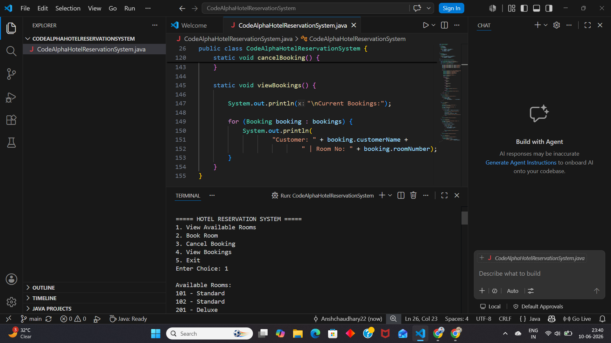

**Hotel Reservation System**

A console-based Hotel Reservation System developed in Java that enables users to manage hotel room reservations efficiently. The application allows customers to view available rooms, book rooms, cancel reservations, and view booking details through an interactive menu-driven interface.

**Project Overview**

This project simulates the basic functionalities of a hotel reservation system using Object-Oriented Programming (OOP) concepts in Java. It provides a simple and user-friendly interface for managing room bookings and reservations.

**Features**

* View available rooms
* Book hotel rooms
* Cancel existing reservations
* Display current bookings
* Menu-driven console interface
* Simple payment simulation
* Object-Oriented design

**Technologies Used**

* Java
* Object-Oriented Programming (OOP)
* ArrayList Collections
* Scanner Class
* Console-Based User Interface

**Concepts Implemented**

* Classes and Objects
* Constructors
* ArrayLists
* Loops
* Conditional Statements
* User Input Handling
* Menu-Driven Programming
* Data Management
  

**Future Improvements**

* MySQL Database Integration
* User Authentication System
* Online Payment Gateway
* Room Pricing Module
* Reservation Dates
* File Handling
* GUI using Java Swing or JavaFX

**Learning Outcomes**

This project helped in understanding:

* Real-world implementation of OOP concepts
* Collection Framework (ArrayList)
* Reservation management logic
* Java console application development

**Author**

Ansh
Developed as part of the **CodeAlpha Java Programming Internship**.

**Program Output**

